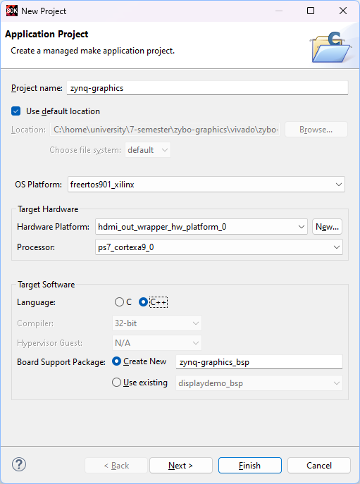
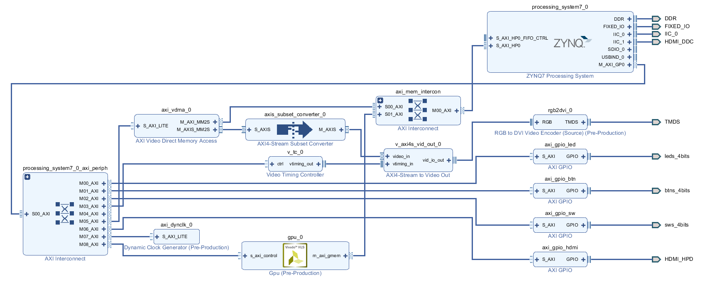

<div align="center">
  <h3 align="center">Real-Time Graphics on the Xilinx Zynq FPGA</h3>
  <p align="center">
    Submission for the course <i>Embedded Real-Time Systems</i> (fall 2024) <br>
    A platform capable of real-time full HD graphics at 60 frames-per-second.
  </p>
</div>

## About The Project


This repository demonstrates a complete real-time graphics platform on the Digilent Zybo board, capable of __Full HD (1920x1080) at 60 FPS__. The system is co-designed in hardware and software to offload graphics rendering from the CPU onto a custom GPU IP core, freeing the CPU for other tasks. A two-player Pong game serves as a proof-of-concept.

## Report

Available [here](https://github.com/apedersen00/zybo-graphics/releases/download/v1.0/real-time-graphics.pdf).

## Features

- __Custom GPU IP__ for hardware-accelerated rendering and alpha compositing. Made using HLS.

- __Dual-Buffered Display Pipeline__ outputting over HDMI.

- __FreeRTOS Integration__ for easy task scheduling and future scalability.

- __Game Engine__ framework that offers expandability.

## Repository Structure

The overall repository structure is listed below.

```
zybo-graphics:
+---hls
|   +---src
|   \---tb
+---media
+---typst
\---vivado
    +---ip_repo
    |   +---axi_dynclk
    |   +---gpu_ip
    |   +---rgb2dvi
    |   \---tmds_v1_0
    +---sdk
    \---src
        +---bd
        \---constraints
```

- `hls/`: contians the source code for the GPU and testbench.

- `typst/`: contains the project report in [Typst format](https://github.com/typst/typst)

- `vivado/`: contains scripts for regenerating the project.

- `vivado/ip_repo/`: contains IP cores for the project.

- `vivado/sdk/`: contains the SDK source files.

- `vivado/src/bd/`: contains the block design `.tcl`

- `vivado/src/constrains/`: contains the constraint file for the Zybo board.

## Getting Started

1. Clone the repository.

```shell
> git clone https://github.com/Ponti17/zybo-graphics
```

2. Regenerate the Vivado project.

```shell
zybo-graphics/vivado> .\build.bat
```

3. Generate bitstream.

4. Export hardware: `File->Export->Export Hardware` check `include bitstream`.

5. Launch the SDK: `File->Launch SDK`

6. Create new project with the following settings:

<div align="center">
    
</div>

7. Right click on `src/` folder and `Import->General->File System`. Select the `vivado/sdk/` folder from this directory and import all files and directories.

8. Build project.

9. `Xilinx Tools->Program FPGA`.

10. Right click on project `Run As->Launch on Hardware`.

## Report

The report can be find under releases. It can also be compiled with

```shell
typst compile typst/main.typ
```

## Block Design

<div align="center">
    
</div>